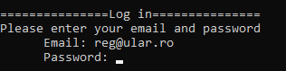
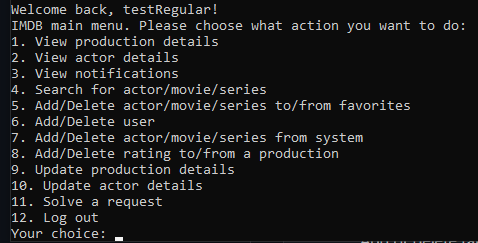
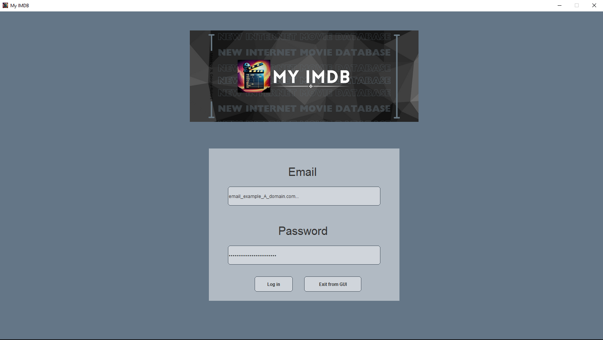
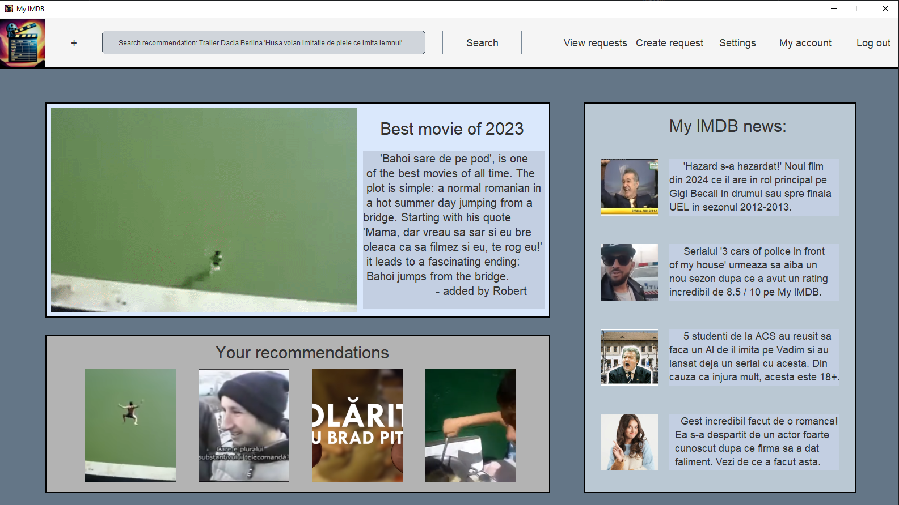
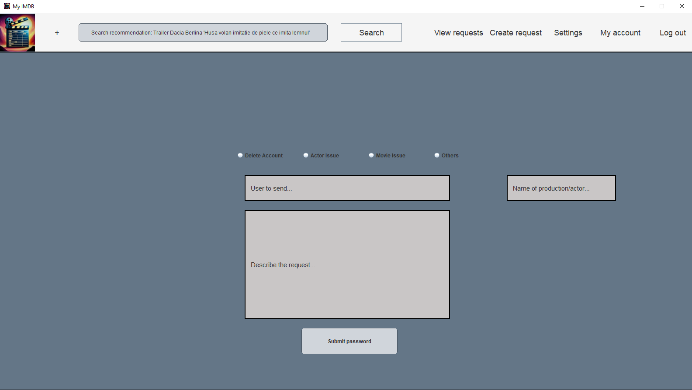
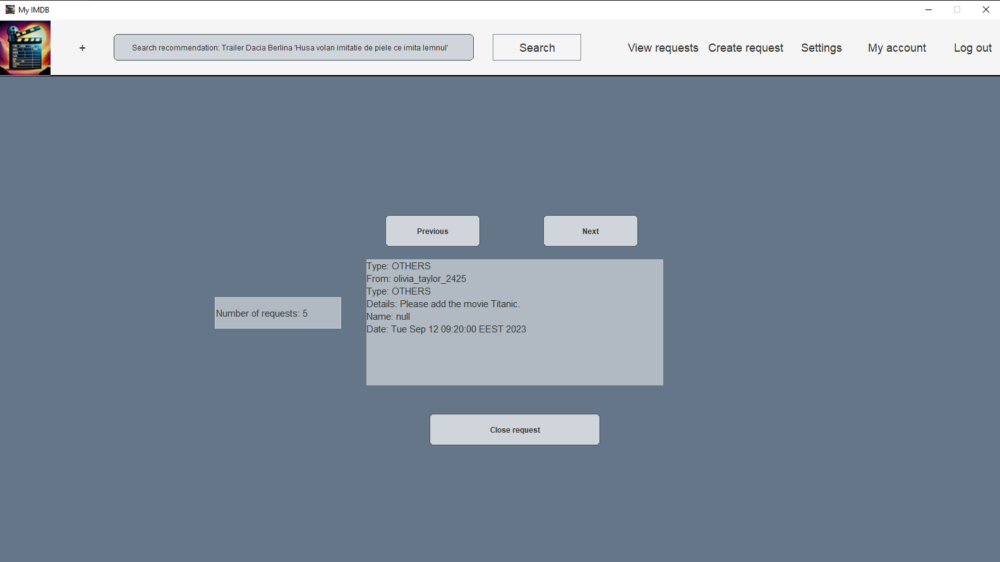

<hr>


# My IMDB

**My IMDB** is a college project which I had to solve as a homework. Using Gradle, Java and Jackson, I've created a simple but useful program to contain a database of movies, actors and users.

# Requirments:

You needs Java 17+ to run it.

## How to run the program.
After you download the zip, make sure you unzip it in a folder with its contentes.
For both Windows and Ubuntu open a terminal and type to run it:

```bash
  java -jar "<path-to-the-file>/IMDB.jar>"
```

## How to run the source code.

You have to replace all the paths from the GUI classes where it says "./assets/remaining-path" with "./src/main/java/Assets/remaining-path" to run on any IDE.
<br>
After you can run the main function from the IMDB class in "src/main/java/org/example/IMDB".
<br>
If you want to hear the song I've made, you have to copy the song from the zip installation file (./assets/song/My_Brick_Breaker_OST.wav <- made by me) and to put it in "./src/main/java/Assets/song".

## Functions

|                             Function                            | Regular | Contributor | Admin |
|:---------------------------------------------------------------:|:-------:|:-----------:|:-----:|
|                     View production details                     |    x    |      x      |   x   |
|                        View actor details                       |    x    |      x      |   x   |
|                        View notifications                       |    x    |      x      |   x   |
|                Search for any actor or production               |    x    |      x      |   x   |
| Add or delete an actor or a production to or from the favorites |    x    |      x      |   x   |
|                        Add or delete user                       |         |             |   x   |
|         Add or delete actor or production from database         |         |      x      |   x   |
|           Add or delete rating to or from a production          |    x    |             |       |
|                    Update production details                    |         |      x      |   x   |
|                       Update actor details                      |         |      x      |   x   |
|                         Solve a request                         |         |      x      |   x   |
|                     Log in / log out system                     |    x    |      x      |   x   |

<hr>

<section>
  <h1>Menu CLI</h1>
  <div style="display: block; alignment: center; top: 0 0 0 0;">
    
    
  </div>

  <h1>Menu GUI</h1>
  <div style="display: block; alignment: center; top: 0 0 0 0;">
    <h3>Log in</h3>
    
    <h3>Homepage</h3>
    
    <h3>Search</h3>
    
    <h3>Create Request</h3>
    
    <h3>View Requests</h3>
    
  </div>
</section>

